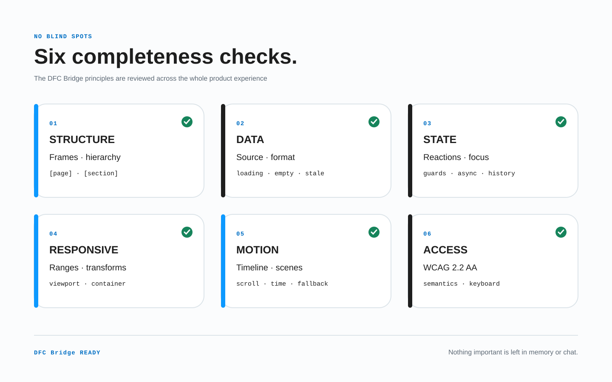

<h1>
  <picture>
    <source media="(prefers-color-scheme: dark)" srcset="assets/brand/dfc-bridge-lockup-dark.svg">
    <source media="(prefers-color-scheme: light)" srcset="assets/brand/dfc-bridge-lockup-light.svg">
    
  </picture>
</h1>

## Design Frontend Contract

**Designs that can cross the gap.**

DFC Bridge is a target-independent methodology for making interface designs transferable: from Figma or any other design source into code, design systems, no-code tools, internal editors, or AI-assisted implementation pipelines.



**No blind spots** does not mean every answer is known immediately. It means every relevant unknown is explicit, scoped, owned, assigned a blocking status and review point, and given a safe fallback.

Languages: [English](README.md) · [Русский](README.ru.md)

**Documentation site:** [poliklot.github.io/dfc-bridge](https://poliklot.github.io/dfc-bridge/)

> **DFC Bridge is not a tool and not a platform adapter.**
> DFC Bridge is the contract that makes a design understandable before anyone tries to implement it.

## Where to start

Do not read the documentation front to back. Choose your task:

| I want to… | Start here | Then use |
| --- | --- | --- |
| prepare a design for the first time | **[Designer quick start](docs/00-designer-quick-start.md)** | [DFC Bridge by example](examples/README.md) |
| review a design before handoff | **[Preflight checklist](docs/08-preflight-checklist.md)** | [Common designer mistakes](docs/09-common-designer-mistakes.md) |
| resolve one specific question | **[Example catalog](examples/README.md)** | [Tag grammar](docs/13-tag-grammar.md) |
| build a validator or adapter | **[Transfer contract](docs/04-transfer-contract.md)** | [Validation and autochecks](docs/11-validation-and-autochecks.md) |

> **Recommended designer path:** quick start → matching example → checklist. The full specification is reference material, not a prerequisite.

## The name

**DFC Bridge — Design Frontend Contract** is the public name. “Bridge” stays the natural spoken shorthand: the design becomes a bridge between intention and implementation. Product names are **DFC Bridge Assistant** and **DFC Bridge Explorer**; technical slugs use `dfc-bridge` and `dfc-bridge-*`.

The six principles retain the Bridge mnemonic:

| Letter | Principle | Rule |
| --- | --- | --- |
| **B** | **Breakpoints** | Responsive states are explicit and comparable as one logical tree. |
| **R** | **Roles** | A layer role is clear from Figma structure, UI Kit metadata, or a required DFC Bridge intent tag. |
| **I** | **Identity** | Logical elements keep stable keys and tree positions across breakpoints. |
| **D** | **Dependencies** | Links, modals, states, anchors, and actions are declared. |
| **G** | **Geometry** | Position, size, spacing, and text metrics are reproducible. |
| **E** | **Exceptions** | Assets, fixed heights, overflow, decor, and non-standard behavior are intentional. |

## Brand vocabulary

Use the name consistently:

- **DFC Bridge-ready design** — a design that can be transferred without guessing.
- **DFC Bridge Contract** — the structured data expected from the design.
- **DFC Bridge Preflight** — the checklist before handoff.
- **DFC Bridge Adapter** — a target-specific implementation layer.
- **DFC Bridge Linter** — a future validator for design mistakes.
- **DFC Bridge Exception** — an intentional deviation with an explicit reason.

The visual mark follows the same contract: six stable modules stand for the six DFC Bridge principles and form one transferable identity. See the [brand system](docs/brand-system.md) for meaning, colors, clear space, and source assets.

Short formula:

```text
DFC Bridge-ready = stable identity + declared behavior/data/accessibility + tracked unknowns and deviations
```

## Why DFC Bridge exists

A design that should be transferred by humans, AI agents, or deterministic tools must be authored as a system, not as a visual sketch.

DFC Bridge is not tied to any specific platform. It does not prescribe a particular framework, CMS, visual editor, runtime, or design-to-code tool. Target adapters may map the same contract to HTML/CSS, React, Vue, mobile UI, internal tools, or any other implementation surface.

## Core idea

DFC Bridge separates two things:

1. **Figma metadata** — the technical truth of the design: node type, Auto Layout, hierarchy, constraints, positioning, component source, variants.
2. **DFC Bridge intent tags** — product meaning Figma does not know by itself: page, route, section, link, action, field, modal, state, decor, asset, exception.

Rich data schemas, responsive transformations, state machines, motion timelines, accessibility requirements, target capabilities, questions, and delivery evidence live in the structured `bridge` contract—not in dozens of flat layer tags. Same logical tree remains the responsive default; a different composition requires an explicit mapping.

Designers do not duplicate technical properties by hand. They build proper structure in Figma and use tags only for transferable intent.

No accidental free-floating layers. No mystery buttons. No responsive versions that silently change content meaning or rebuild the element tree.

## Full documentation

### Practice

- [Designer quick start](docs/00-designer-quick-start.md)
- [DFC Bridge by example](examples/README.md)
- [Preflight checklist](docs/08-preflight-checklist.md)
- [Common designer mistakes](docs/09-common-designer-mistakes.md)
- [Hard cases and edge cases](docs/10-hard-cases-and-edge-cases.md)

### Core rules

- [Design rules](docs/01-design-rules.md)
- [Layer naming and identity](docs/02-layer-naming-and-identity.md)
- [Responsive breakpoints](docs/03-responsive-breakpoints.md)
- [Interactions and targets](docs/05-interactions-and-targets.md)
- [Wrapper policy](docs/06-wrapper-policy.md)
- [Height and overflow](docs/07-height-and-overflow.md)
- [Components, UI Kit, and Page Sections](docs/14-components-and-ui-kit.md)
- [Page routing and views](docs/15-page-routing-and-views.md)
- [Data and visualization](docs/20-data-and-visualization.md)
- [Motion and long scroll](docs/21-motion-and-scroll.md)
- [State machines and reactions](docs/22-state-machines-and-reactions.md)

### Reference and tooling

- [Tag grammar](docs/13-tag-grammar.md)
- [Transfer contract](docs/04-transfer-contract.md)
- [Variation axes](docs/16-variation-axes.md)
- [Validation and autochecks](docs/11-validation-and-autochecks.md)
- [Validator rule catalog](validator/rules.json)
- [Project roadmap](docs/12-project-roadmap.md)
- [Brand system](docs/brand-system.md)
- [Accessibility profile (WCAG 2.2 AA)](docs/23-accessibility-profile.md)
- [Delivery lifecycle and deviations](docs/24-delivery-lifecycle.md)

## Tooling

[DFC Bridge Assistant](https://www.figma.com/community/plugin/1654485530503673254) is the companion Figma plugin. Its installable build is public in Figma Community, while its implementation repository is private. The methodology, documentation, schemas, checklists, and rule catalog in this repository remain open under MIT.

The catalog contains **107 rules**. Public coverage snapshots record two exact, non-additive emitted-rule unions: Page Check covers **42** (40 automatic and 2 heuristic), while **Check selected section** covers **26** (24 automatic and 2 heuristic; 20 local and 6 selected-variant). Both include the blocking source-structure rules; structured and manual coverage remains explicit.

## Local development

Use Node.js from [`.nvmrc`](.nvmrc), then install exactly from the lockfile:

```bash
nvm use
npm ci
npm run dev
```

Run the complete verification pipeline before a pull request:

```bash
npm test
npx playwright install chromium # first local run only
npm run test:e2e
npm audit
```

Canonical content lives in `docs/`, `docs/ru/`, and `examples/`. Do not edit generated files under `src/content/docs/en/` or `src/content/docs/ru/`; `npm run content:sync` recreates them from [`validator/site-content.json`](validator/site-content.json). Use `SITE_BASE=/ npm run build` when testing a root-hosted build.

See [CONTRIBUTING.md](CONTRIBUTING.md) for contract-change rules and the complete review flow, and [CHANGELOG.md](CHANGELOG.md) for public methodology releases.

## Minimal example

```text
Home Page [page=home] [route=/] [bp=1200] [view=default]
  Hero [section=home-hero]
    hero-bg [decor]

    hero-copy
      hero-title
      hero-subtitle

    button-group
      email-link [href=mailto:sales@example.com]
      contact-cta [action=modal:contact-modal]

Contact Modal [modal=contact-modal]
  contact-modal-content
```

## License

MIT.
